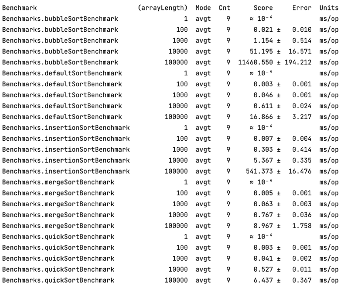

# Effective Java 

Project contains basic algorithms and cache implementations.

## Algorithms

- Binary tree bypass
- Binary search (iterative, recursive)
- Sort algorithms (insertion sort, bubble sort, merge sort, quick sort)

Modules contain `...Demo.java` classes that demonstrate implemented functionality.

Iterative and recursive binary searches as well as different sorting approaches are compared
using JMH (Java Microbenchmark Harness). Benchmarks show different scenarios average time execution
and help to compare results. Benchmark result example:

## Cache

- Plain Java LFU cache
- Guava LRU cache

Cache characteristics:

1) Concurrency support
2) Removal listener: default listener adds removed entry to log
3) Eviction policy: time-based on last access (5 seconds by default)
4) Statistics: average time of adding new values to the cache, number of cache evictions

## Notes

- Java 17 is used
- Code coverage threshold: 85%
- Unit tests: JUnit 5
- Checkstyle is configured
